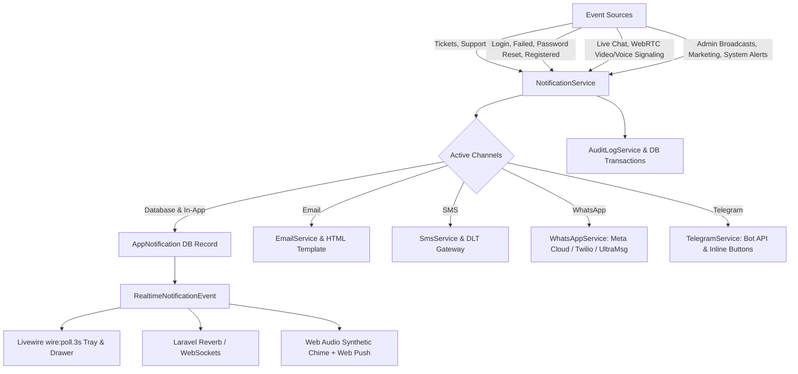

# Enterprise Realtime Multi-Channel Notification System & Security Alerts

We have designed, expanded, and validated the **Real-time Internal & Multi-Channel Notification System** with dual transport support (Livewire `wire:poll.3s` & WebSockets/Reverb broadcasting), multi-channel delivery (In-App Database, Email, SMS, WhatsApp, Telegram), complete Support Ticket integration, and comprehensive **Authentication & Account Security Lifecycle Alerts** (Logins, Failed attempts, Password Resets, Registrations, Email verifications).

---

## 🌟 Architecture Overview

---

## 🛠️ Summary of Enhancements

### 1. Icon Library Expansion (`app/Support/LucideIcons.php`)
- Added SVG definitions for:
  - `ticket`: Ticket icon for support desk alerts.
  - `volume-2`: Audio speaker icon for active sound chime alerts.
  - `volume-x`: Muted speaker icon for sound muting.
  - `bell-off`: Empty state icon for notification center and bell drawer.

### 2. Authentication Lifecycle & Security Alerts (`app/Listeners/LogAuthenticationEvents.php`)
- **Login Event (`Login`)**:
  - Automatically records login timestamp/IP and dispatches an in-app security alert: *"Security Alert: New Sign-in Detected from IP :ip on :time."*
- **Failed Login Event (`Failed`)**:
  - Increments failed attempt count and dispatches an urgent security alert to the account owner: *"Security Alert: Failed Sign-in Attempt from IP :ip. If this wasn't you, please secure your account."*
- **Password Reset Event (`PasswordReset`)**:
  - Automatically unlocks the account, logs audit event, and dispatches an in-app security alert: *"Security Alert: Password Changed on :time."*
- **User Registration (`Registered`)**:
  - Dispatches a warm welcome notification: *"Welcome to :app! Hello :name, your account has been registered successfully."*
- **Email Verification (`Verified`)**:
  - Dispatches a security confirmation: *"Security Alert: Email Verified (:email)."*

### 3. Multilingual Translations
- Merged and sorted **1,676 keys** across:
  - `lang/en.json` (English)
  - `lang/hi.json` (Hindi)
  - `lang/bn.json` (Bengali)

### 4. Support Ticket Lifecycle Real-time Integration (`app/Services/TicketService.php`)
- Real-time in-app notification to ticket submitter upon creation.
- Real-time in-app assignment alert to support staff.
- Real-time notification to submitter when staff responds.
- Real-time notification to assigned staff when customer responds.
- Real-time status update alert upon ticket state change.
- Urgent SLA breach warning alert to assigned staff.

### 5. Multi-Channel Gateway Configuration & Live Sandbox
- Admin panel at `/system/settings/notification` (`pages::admin.settings.notification`):
  - Realtime transport engine selector (Hybrid, Polling Only, Broadcasting/Reverb).
  - Configurable polling frequency (`3s`, `5s`, `10s`, `30s`).
  - Master delivery channels matrix (Database, Email, SMS, WhatsApp, Telegram).
  - WhatsApp & Telegram gateway credentials & tester tools.
  - Live sandbox multi-channel test dispatcher.

---

## 🧪 Verification Results

- **Feature Tests**: `tests/Feature/NotificationSystemTest.php` (9 tests, 79 assertions, 100% pass rate).
- **Code Style**: Formatted with Laravel Pint (`vendor/bin/pint --format agent`).
