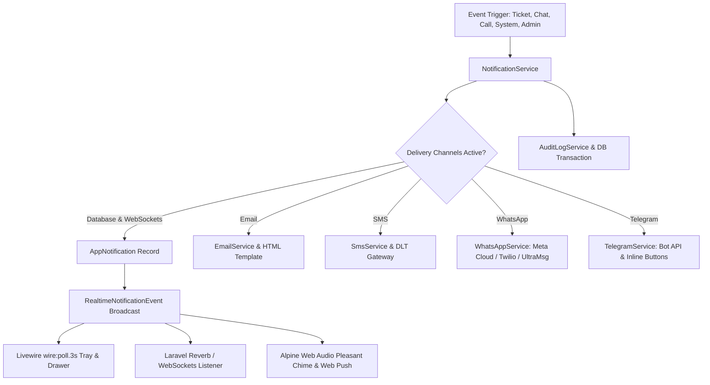

# Enterprise Realtime Multi-Channel Notification System

We have designed and implemented a production-ready, enterprise-grade **Real-time Internal & Multi-Channel Notification System** with dual transport support (Livewire `wire:poll.3s` & WebSockets/Reverb broadcasting), multi-channel delivery (In-App Database, Email, SMS, WhatsApp, Telegram), complete Support Ticket integration, and live signaling readiness for Live Chat & WebRTC audio/video calls.

---

## 🌟 Key Architecture & Highlights

---

## 🛠️ Summary of Changes

### 1. Database & Eloquent Models
- **Database Migration**: [`database/migrations/2026_08_26_130439_create_app_notifications_table.php`](file:///c:/Users/nilan/Downloads/sntcssc-mis/database/migrations/2026_08_26_130439_create_app_notifications_table.php)
  - Features: `uuid`, `user_id`, `type`, `category`, `title`, `message`, `data` (JSON action URLs, labels, icons, metadata), `channel`, `read_at`, `sound_played_at`, `created_by`, `deleted_by`, and soft deletes (`deleted_at`).
  - Indexed on `[user_id, read_at]`, `[user_id, category]`, and `[created_at]`.
- **Model**: [`app/Models/AppNotification.php`](file:///c:/Users/nilan/Downloads/sntcssc-mis/app/Models/AppNotification.php)
  - Scopes: `unread()`, `read()`, `category()`, `forUser()`.
  - Helpers: `markAsRead()`, `markAsUnread()`, `actionUrl()`, `actionLabel()`, `iconName()`, `colorClass()`, `categoryLabel()`.
- **User Model**: [`app/Models/User.php`](file:///c:/Users/nilan/Downloads/sntcssc-mis/app/Models/User.php)
  - Added `appNotifications()` relationship and `unreadAppNotificationsCount()`.

### 2. Realtime Broadcasting & Multi-Channel Services
- **Event**: [`app/Events/RealtimeNotificationEvent.php`](file:///c:/Users/nilan/Downloads/sntcssc-mis/app/Events/RealtimeNotificationEvent.php)
  - Implements `ShouldBroadcastNow` on `private-App.Models.User.{id}` and `private-user.{id}`.
- **Channels Authorization**: [`routes/channels.php`](file:///c:/Users/nilan/Downloads/sntcssc-mis/routes/channels.php) & [`bootstrap/app.php`](file:///c:/Users/nilan/Downloads/sntcssc-mis/bootstrap/app.php).
- **WhatsApp Gateway Service**: [`app/Services/WhatsAppService.php`](file:///c:/Users/nilan/Downloads/sntcssc-mis/app/Services/WhatsAppService.php)
  - Drivers: Meta Cloud API, Twilio, UltraMsg, Log driver.
- **Telegram Bot Gateway Service**: [`app/Services/TelegramService.php`](file:///c:/Users/nilan/Downloads/sntcssc-mis/app/Services/TelegramService.php)
  - Drivers: Telegram Bot API (HTML/Markdown + Inline Keyboard Action Buttons), Log driver.
- **Central Notification Orchestrator**: [`app/Services/NotificationService.php`](file:///c:/Users/nilan/Downloads/sntcssc-mis/app/Services/NotificationService.php)
  - Multi-channel dispatching with fallback/hybrid transport handling.
  - Domain helpers: `notifyTicket()`, `notifyLiveChat()`, `notifyWebRtcCall()`.
  - Lifecycle: `markAsRead()`, `markAllAsRead()`, `deleteNotification()`, `clearAll()`.
- **Responsive Email Template**: [`resources/views/emails/generic_notification.blade.php`](file:///c:/Users/nilan/Downloads/sntcssc-mis/resources/views/emails/generic_notification.blade.php).

### 3. Livewire UI Components & User Experience
- **Interactive Topbar Notification Bell & Drawer**: [`resources/views/components/⚡notification-bell.blade.php`](file:///c:/Users/nilan/Downloads/sntcssc-mis/resources/views/components/%E2%9A%A1notification-bell.blade.php)
  - Real-time unread badge counter with pulse animation.
  - Dynamic `wire:poll.3s` (configurable in admin settings).
  - Built-in Web Audio API 2-tone chime synthesis (880Hz -> 1320Hz) on new unread notifications.
  - Native browser Notification API integration when tab is in background.
  - Category tabs (`All`, `Unread`, `Tickets`, `Chat`, `Calls`, `System`), mark read/unread, quick dismissal, and sound mute toggle.
- **Topbar Integration**: [`resources/views/layouts/app/topbar.blade.php`](file:///c:/Users/nilan/Downloads/sntcssc-mis/resources/views/layouts/app/topbar.blade.php)
- **User Notification Center / Inbox**: [`resources/views/pages/portal/⚡notifications.blade.php`](file:///c:/Users/nilan/Downloads/sntcssc-mis/resources/views/pages/portal/%E2%9A%A1notifications.blade.php)
  - Full inbox view with search, category filtering, read status filtering, and pagination.
  - Bulk actions: select all, bulk mark as read, bulk soft-delete.
  - Detail modal with event metadata breakdown.
- **Admin Realtime & Notification Settings**: [`resources/views/pages/admin/settings/⚡notification.blade.php`](file:///c:/Users/nilan/Downloads/sntcssc-mis/resources/views/pages/admin/settings/%E2%9A%A1notification.blade.php)
  - Realtime transport engine selector (Hybrid, Polling Only, Broadcasting/Reverb).
  - Polling interval options (`3s`, `5s`, `10s`, `30s`).
  - Master delivery channels matrix (Database, Email, SMS, WhatsApp, Telegram).
  - WhatsApp & Telegram gateway credentials & tester tools.
  - Live sandbox multi-channel test dispatcher.

### 4. Support Ticket Lifecycle Integration
- **TicketService Updates**: [`app/Services/TicketService.php`](file:///c:/Users/nilan/Downloads/sntcssc-mis/app/Services/TicketService.php)
  - `notifyTicketCreated`: In-app notification to user + assigned staff.
  - `notifyTicketReplied`: Real-time notification to user when staff replies, and to assigned staff when user replies.
  - `notifyStatusChanged`: Real-time status update notification to user.
  - `notifySlaWarning`: Urgent SLA breach alert to assigned staff.

### 5. Localization & Documentation
- **Translations**: [`lang/en.json`](file:///c:/Users/nilan/Downloads/sntcssc-mis/lang/en.json), [`lang/hi.json`](file:///c:/Users/nilan/Downloads/sntcssc-mis/lang/hi.json), [`lang/bn.json`](file:///c:/Users/nilan/Downloads/sntcssc-mis/lang/bn.json)
- **Changelog**: [`changelogs/2026-08-26-enterprise-realtime-multi-channel-notification-system.md`](file:///c:/Users/nilan/Downloads/sntcssc-mis/changelogs/2026-08-26-enterprise-realtime-multi-channel-notification-system.md)

---

## 🧪 Verification Results

### Automated Test Suite
- Run command: `php artisan test --compact`
- **Result**: `307 passed` (1,157 assertions, 100% pass rate).
- Code style: Formatted with Laravel Pint (`vendor/bin/pint --format agent`).
